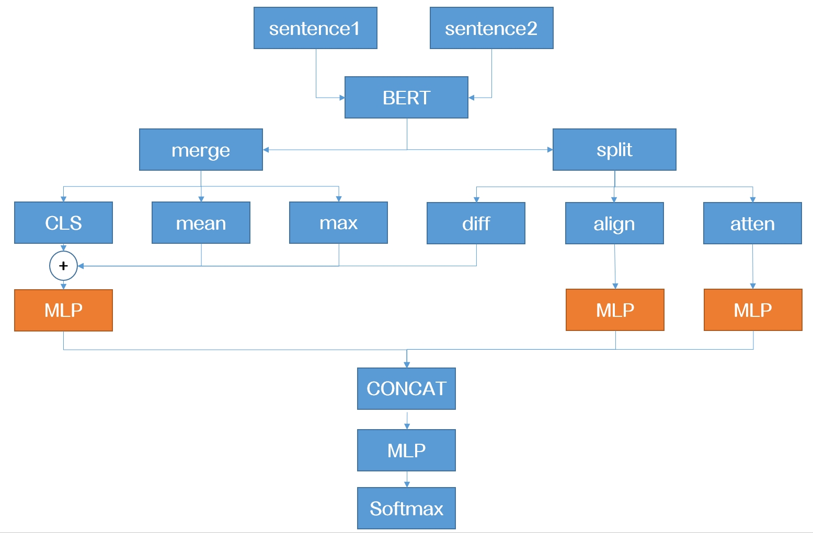

# argument_mining
法律论辩挖掘

基于深度语义交互建模的刑事裁判文书矛盾句识别

## 背景介绍

在司法裁判过程中，诉辩双方的事实主张冲突是案件争议的核心载体。准确识别裁判文书中**原告诉称与被告辩称之间的矛盾句对（Contradictory Statement Pairs）**，不仅能够指向案件的关键分歧点，还可辅助法官高效提炼争议焦点，提升文书撰写质量，对智慧司法系统建设具有重要意义。

## 任务定义

本研究聚焦刑事裁判文书中的矛盾句检测任务。基于 [SMP-CAIL2020]数据集中的 815 条标注样本，任务被建模为一个**二分类问题**：

- **输入**：一对句子（原告 vs 被告陈述）
- **输出**：是否存在语义矛盾（标签 0/1）

## 技术方案

### 1. 数据构建
- 将原始裁判文书中原告/被告的句子对构造成矛盾识别的训练样本
- 使用标签 `0`/`1` 表示是否存在矛盾关系

### 2. 模型设计与创新

- **基线模型**：
  - BERT + `[CLS]` 分类器，作为初始性能参考
- **结构优化**：
  - 设计伪孪生网络结构：BERT 双编码器 + 四种特征聚合方式（Max / Diff / Mean / CLS）
    
- **激活函数**：
  - 使用了TeLU作为MLP中的激活函数，增强了语义提取能力

  $$ 
  \mathrm{TeLU}(x) = x \cdot \tanh\left(e^x\right) 
  $$

- **注意力增强机制**：
  - 引入词级对齐机制
  - 增加交叉注意力模块模拟辩方对于诉方的交互
  - 模型最终准确率达 **0.79**

## 训练

将SMP-CAIL2020-train.csv置于data/，运行prepare.py切割

在config/bert_config.json中调整参数，然后运行

```
python train.py --config_file 'config/bert_config.json'
```

## 数据集说明

- **名称**：法律矛盾句识别数据集（SMP-CAIL2020）
- **来源**：[中国法律智能挑战赛 CAIL2020]
- **任务目标**：识别原告诉称与被告辩称间的矛盾关系（二分类）

## 代码框架说明

来自https://github.com/gaoyixu/CAIL2020-Argument-Mining

## 作者

| 作者   | 联系方式              |
|:--------:|:----------------------:|
| ZCL  | 202320037@uibe.edu.cn |
| ZHB  | 2624678993@qq.com |
| WYH  | 2032681050@qq.com |
Copyright UIBE 法学院 信息学院|